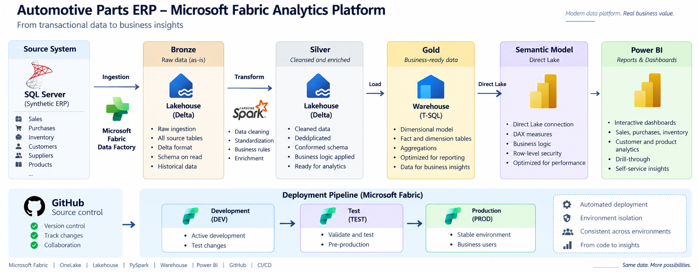
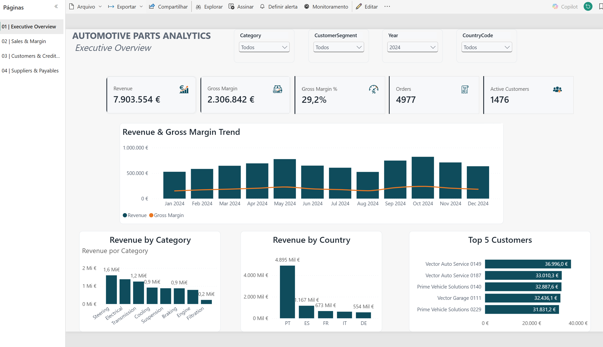
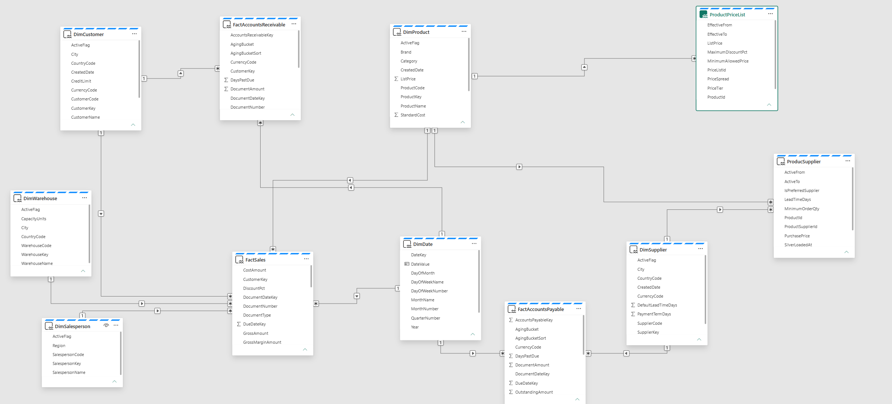
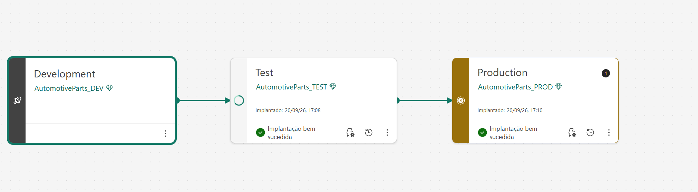
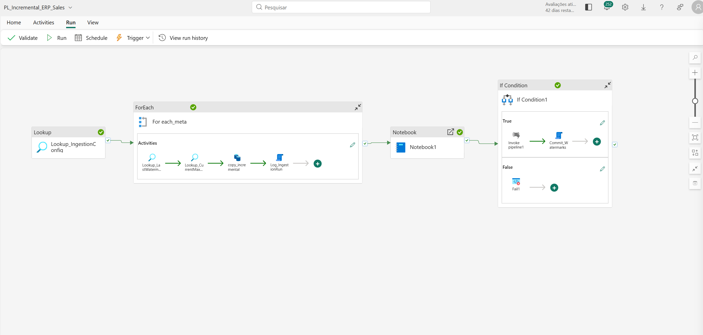
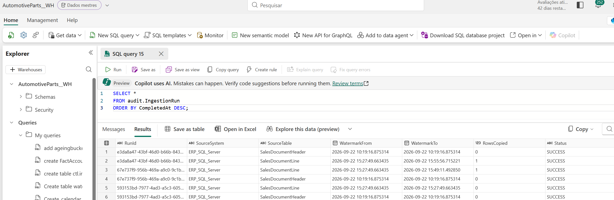
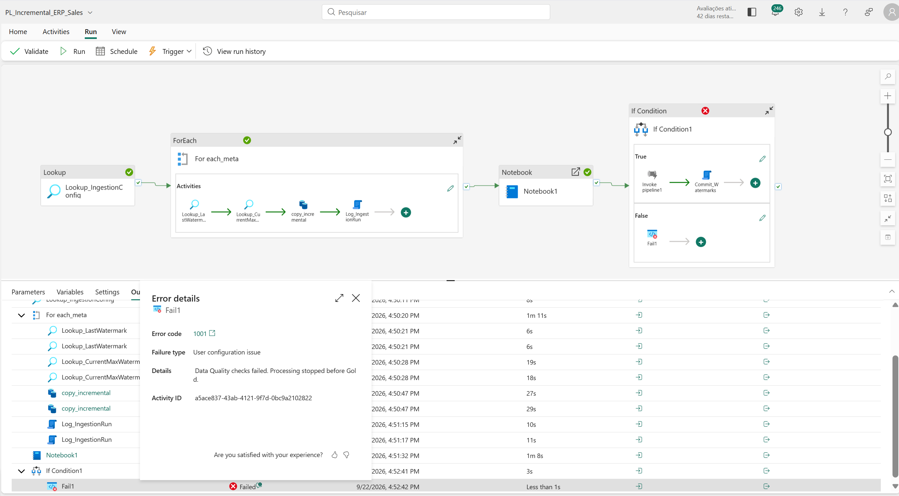
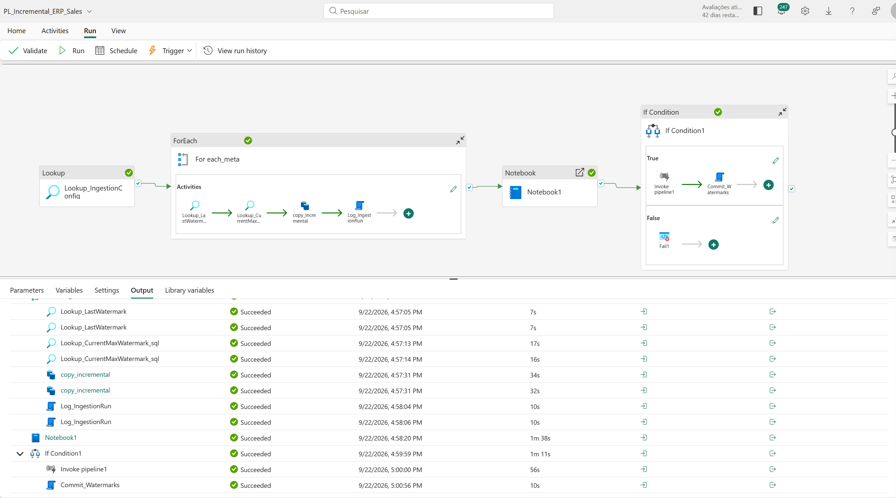

# Automotive Parts ERP — Microsoft Fabric Analytics Platform

End-to-end Microsoft Fabric analytics solution simulating the modernization of a legacy automotive-parts ERP.

This project demonstrates a complete analytics workflow using Microsoft Fabric, from operational data ingestion and transformation to dimensional modelling, Direct Lake semantic modelling, Power BI reporting, Git source control, and controlled deployment across DEV, TEST, and PROD environments.

> **Note:** All data used in this project is synthetic and was created exclusively for learning, demonstration, and portfolio purposes.

---

## Architecture

### End-to-End Data Flow

```text
Synthetic SQL Server ERP
        ↓
Microsoft Fabric Data Factory
        ↓
Bronze Lakehouse
        ↓
PySpark Transformations
        ↓
Silver Delta Tables
        ↓
Silver-to-Gold Pipeline
        ↓
Warehouse STG
        ↓
T-SQL Transformations
        ↓
Gold Fabric Warehouse
        ↓
Direct Lake Semantic Model
        ↓
Power BI
```

The core analytical platform follows a Medallion-style architecture:

**SQL Server → Bronze → Silver → Gold / Warehouse → Direct Lake → Power BI**

---

## Business Scenario

The project simulates the analytics modernization of an automotive-parts company operating a traditional ERP environment.

The business scenario was designed around typical ERP processes such as:

- Customers
- Products
- Suppliers
- Warehouses
- Salespeople
- Sales transactions
- Product pricing
- Product-supplier relationships
- Accounts receivable
- Accounts payable

The objective is to transform operational ERP data into a modern, governed and scalable analytical platform using Microsoft Fabric.

---

# Data Platform

## Bronze Layer

The Bronze layer represents the raw ingestion area of the platform.

Operational ERP data is ingested from SQL Server into a Microsoft Fabric Lakehouse while preserving the source structure as much as possible.

### Technologies

- Microsoft Fabric Data Factory
- Microsoft OneLake
- Fabric Lakehouse
- Delta tables
- On-premises Data Gateway

### Purpose

The Bronze layer provides:

- Raw source preservation
- Centralized ingestion
- Source-system isolation
- Traceability
- A reliable starting point for downstream processing

---

## Silver Layer

The Silver layer contains cleaned, standardized and business-ready intermediate datasets.

PySpark notebooks transform Bronze data before it is consumed by the analytical Warehouse.

### Main Notebooks

```text
NB01_Silver_Sales
NB02_Silver_Commercial
```

### Typical Transformations

- Data-type standardization
- Column normalization
- Data cleansing
- Deduplication
- Business-rule application
- Schema normalization
- Key-field validation
- Preparation of analytical entities

Silver data is stored as Delta tables in the Fabric Lakehouse.

---

## Gold Layer

The Gold layer is implemented in **Microsoft Fabric Warehouse**.

It contains the curated dimensional model consumed by the Direct Lake Semantic Model.

### Gold Processing Flow

```text
Silver Delta Tables
        ↓
Warehouse STG
        ↓
T-SQL Transformations
        ↓
Gold / dbo
        ↓
Direct Lake Semantic Model
```

The permanent Silver-to-Gold pipeline is:

```text
PL_Silver_To_Gold
```

The Gold layer provides:

- Business-ready analytical data
- Stable reporting structures
- Reusable dimensions and facts
- Dimensional modelling
- A performant analytical source for Power BI

---

# Dimensional Model

The Fabric Warehouse implements a star-schema-oriented analytical model.

### Dimensions

```text
DimCustomer
DimDate
DimProduct
DimSalesperson
DimSupplier
DimWarehouse
```

### Facts

```text
FactSales
FactAccountsReceivable
FactAccountsPayable
```

### Supporting Tables

```text
ProductSupplier
ProductPriceList
```

The dimensional design separates descriptive business entities from transactional data and provides a reusable analytical structure.

---

# Power BI Report

The final analytical experience is delivered through Power BI using the Direct Lake Semantic Model.

### Executive Overview



The report supports analysis across multiple business areas, including:

- Revenue and margin
- Sales trends
- Product performance
- Customer analysis
- Supplier analysis
- Warehouse performance
- Accounts receivable
- Accounts payable

---

# Semantic Model

The analytical Warehouse is consumed through a **Direct Lake Semantic Model**.

Direct Lake allows the semantic layer to query data stored in OneLake without using a traditional imported Power BI dataset.



The model includes:

- Fact and dimension relationships
- DAX measures
- Time intelligence
- KPIs
- Business calculations
- Shared analytical logic

### Example Measures

```text
Net Revenue
Total Cost
Margin
Average Ticket
Return Rate
Cancelled Sales %
Previous Year Revenue
Revenue Growth %
Online Revenue %
Active Customers
```

---

# CI/CD and Deployment

The solution uses separate environments for development, testing and production.



```text
GitHub
   ↕
Development
   ↓
Test
   ↓
Production
```

### Fabric Workspaces

```text
AutomotiveParts_DEV
AutomotiveParts_TEST
AutomotiveParts_PROD
```

Microsoft Fabric Deployment Pipelines are used to promote artifacts across environments:

```text
DEV → TEST → PROD
```

This provides:

- Environment isolation
- Controlled deployments
- Validation before production
- Repeatable releases
- Separation between development and production workloads

---

## Git Source Control

GitHub is used as the source-control system.

The **Development workspace** is connected to Git, while TEST and PROD are populated through Fabric Deployment Pipelines rather than maintained as duplicate Git folders.

```text
GitHub
   ↕
DEV Workspace
   ↓
Fabric Deployment Pipeline
   ↓
TEST
   ↓
PROD
```

This keeps source control focused on development while Fabric manages environment promotion.

---

## Environment-Specific Direct Lake Connections

Each environment contains its own Warehouse and Semantic Model.

```text
DEV Semantic Model  → DEV Warehouse
TEST Semantic Model → TEST Warehouse
PROD Semantic Model → PROD Warehouse
```

This prevents TEST or PROD reports from accidentally querying data from another environment.

---

# V2 — Production-Oriented Data Engineering

V2 evolves the original end-to-end platform with production-oriented ingestion, observability and automated data-quality controls.

The objective was to move beyond full-load pipelines and introduce reusable engineering patterns for incremental processing and operational control.

---

## Metadata-Driven Incremental Ingestion

The V2 ingestion framework is controlled through metadata rather than creating a separate hardcoded pipeline for every source table.

The main pipeline is:

```text
PL_Incremental_ERP_Sales
```



### Processing Pattern

```text
Lookup_IngestionConfig
        ↓
Parallel ForEach
        ↓
┌─────────────────────────────────┐
│ Read previous watermark         │
│ Read current source watermark   │
│ Copy incremental rows           │
│ Log ingestion execution         │
└─────────────────────────────────┘
        ↓
Data Quality Validation
        ↓
PASS / FAIL Gate
```

The metadata configuration defines which entities are processed and how they are processed.

Example configuration fields include:

```text
SourceSystem
SourceSchema
SourceTable
TargetSchema
TargetTable
WatermarkColumn
KeyColumn
IsActive
```

Adding another supported table can therefore be driven primarily through configuration instead of duplicating pipeline logic.

---

## Watermark-Based Change Detection

Incremental processing uses a `LastModifiedDate` watermark stored in UTC.

For each source entity, the pipeline processes only records satisfying:

```text
LastWatermark < LastModifiedDate <= CurrentMaxWatermark
```

This creates a controlled processing window.

The framework therefore avoids unnecessary full-table reloads and processes only new or modified records.

### Watermark Control

Watermarks are stored in:

```text
ctl.Watermark
```

Ingestion metadata is stored in:

```text
ctl.IngestionConfig
```

This separates runtime state from pipeline implementation.

---

## Parallel Entity Processing

Active source entities are processed through a metadata-driven `ForEach`.

For example:

```text
SalesDocumentHeader
SalesDocumentLine
```

can be processed by the same reusable pipeline.

The ingestion activities run independently, while watermark commits are centralized to avoid concurrent update conflicts in the Warehouse control tables.

---

## Audit Logging

Each entity execution is recorded in:

```text
audit.IngestionRun
```



Audit information includes:

```text
RunId
SourceSystem
SourceTable
WatermarkFrom
WatermarkTo
RowsCopied
Status
CompletedAt
```

This provides operational traceability and makes it possible to answer questions such as:

- Which entity ran?
- When did it run?
- How many rows changed?
- Which watermark interval was processed?
- Did the ingestion succeed?

---

# Data Quality Framework

V2 introduces a PySpark Data Quality framework implemented in:

```text
NB03_Data_Quality
```

The notebook validates the current incremental batch before data is allowed to continue to the Gold analytical layer.

### Example Technical Checks

- Null business keys
- Duplicate keys
- Missing document references
- Invalid prices
- Invalid quantities
- Referential-integrity checks

### Business-Aware Validation

The framework also applies business-specific rules rather than treating every negative value as invalid.

For example, sales-document quantities follow the document type:

```text
INV / DBN → Quantity must be positive
CRN       → Quantity must be negative
Quantity 0 → Invalid
```

This distinguishes valid credit-note behaviour from genuine data-quality issues.

---

## PASS / FAIL / SKIP Logic

Data Quality rules support three outcomes:

```text
PASS → rows were checked and the rule succeeded
FAIL → rows were checked and invalid data was detected
SKIP → no incremental rows were available for that rule
```

The notebook aggregates individual rule results into a global quality status.

```text
Any FAIL
   ↓
Global DQ Status = FAIL

No FAIL
   ↓
Global DQ Status = PASS
```

The final status is returned to the Fabric pipeline through the notebook exit value.

---

## Data Quality Gate

The pipeline contains an automated quality gate before Gold processing.

```text
Incremental Ingestion
        ↓
NB03_Data_Quality
        ↓
IF_DQ_Pass
      /        \
   PASS        FAIL
    ↓            ↓
Silver/Gold   DQ_FAILED
```

### Failure Scenario

Invalid data is automatically prevented from reaching the Gold analytical layer.



The pipeline intentionally terminates with a controlled error when critical quality rules fail.

Example:

```text
Error code: DQ_FAILED

Data Quality checks failed.
Processing stopped before Gold.
```

### Successful Scenario

When all critical rules pass, processing continues to the Silver-to-Gold pipeline.



This means Gold processing is dependent on successful validation rather than being executed unconditionally.

---

## Safe Watermark Commit

Watermarks are committed only after the required processing path succeeds.

This avoids advancing the source checkpoint when invalid data has been detected.

Conceptually:

```text
Copy incremental batch
        ↓
Audit
        ↓
Data Quality
        ↓
PASS
        ↓
Silver / Gold
        ↓
Commit Watermark
```

If Data Quality fails:

```text
Data Quality = FAIL
        ↓
Gold blocked
        ↓
Watermark not committed
```

This protects against silently skipping rejected data in future incremental executions.

---

# Repository Structure

```text
automotivepartserp/
│
├── DEV/
│   ├── AutomotivePartsReport.Report/
│   ├── AutomotiveParts_Bronze_LH.Lakehouse/
│   ├── AutomotiveParts_SModel.SemanticModel/
│   ├── AutomotiveParts__WH.Warehouse/
│   ├── NB01_Silver_Sales.Notebook/
│   ├── NB02_Silver_Commercial.Notebook/
│   ├── NB03_Data_Quality.Notebook/
│   ├── PL_Incremental_ERP_Sales.DataPipeline/
│   └── PL_Silver_To_Gold.DataPipeline/
│
├── Docs/
│   ├── architecture.png
│   ├── deployment-pipeline.png
│   ├── semantic-model.png
│   ├── report-overview.png
│   ├── v2-incremental-pipeline.png
│   ├── v2-audit-watermark.png
│   ├── v2-data-quality-fail.png
│   └── v2-data-quality-pass.png
│
├── LICENSE
└── README.md
```

---

# Technology Stack

| Area | Technology |
|---|---|
| Operational Source | SQL Server |
| On-Premises Connectivity | On-premises Data Gateway |
| Data Integration | Microsoft Fabric Data Factory |
| Data Lake | Microsoft OneLake |
| Bronze Layer | Fabric Lakehouse |
| Silver Layer | Delta Lake + PySpark |
| Data Transformation | PySpark / T-SQL |
| Incremental Processing | Metadata-driven pipelines + Watermarks |
| Operational Metadata | Fabric Warehouse |
| Audit | Warehouse audit schema |
| Data Quality | PySpark |
| Gold Layer | Microsoft Fabric Warehouse |
| Analytical Model | Star Schema |
| Semantic Layer | Power BI Semantic Model |
| Connectivity | Direct Lake |
| BI | Power BI |
| Source Control | GitHub |
| CI/CD | Fabric Deployment Pipelines |
| Environments | DEV / TEST / PROD |

---

# Key Engineering Concepts Demonstrated

This project demonstrates practical implementation of:

- End-to-end Microsoft Fabric architecture
- Medallion architecture
- Lakehouse architecture
- Delta Lake
- PySpark transformations
- Fabric Warehouse
- Dimensional modelling
- Star-schema design
- T-SQL
- DAX
- Direct Lake
- Power BI Semantic Models
- Power BI reporting
- Git source control
- CI/CD
- DEV / TEST / PROD
- Deployment Pipelines
- Environment-specific data connections
- Incremental ingestion
- Watermark-based processing
- Metadata-driven pipelines
- Parallel entity processing
- UTC timestamp standardization
- Operational audit logging
- Centralized watermark management
- Data Quality validation
- Business-aware validation rules
- Automated PASS / FAIL gates
- Failure handling before Gold processing

---

# Current Project Status

## V1 — Completed

- [x] Synthetic ERP dataset
- [x] SQL Server source
- [x] Fabric Lakehouse
- [x] Bronze ingestion
- [x] PySpark Silver transformations
- [x] Delta tables
- [x] Fabric Warehouse
- [x] STG layer
- [x] Gold dimensional model
- [x] Fact and dimension tables
- [x] T-SQL transformations
- [x] Direct Lake Semantic Model
- [x] DAX business measures
- [x] Power BI report
- [x] GitHub integration
- [x] DEV environment
- [x] TEST environment
- [x] PROD environment
- [x] Fabric Deployment Pipeline
- [x] Environment-specific Direct Lake connections

## V2 — Completed

- [x] Metadata-driven incremental ingestion
- [x] Watermark-based change detection
- [x] UTC modification tracking
- [x] Parallel entity processing
- [x] Reusable ingestion configuration
- [x] Audit logging
- [x] Centralized watermark commit
- [x] PySpark Data Quality framework
- [x] Business-aware validation
- [x] PASS / FAIL / SKIP rule handling
- [x] Automated Data Quality Gate
- [x] Gold processing blocked on quality failure
- [x] Successful and failure-path testing

---

# Roadmap

Future iterations may extend the platform with:

- [ ] Slowly Changing Dimensions — SCD Type 2
- [ ] Delete detection / CDC
- [ ] Advanced error-handling and replay
- [ ] Automated monitoring and alerting
- [ ] Data-platform health dashboard
- [ ] Advanced observability
- [ ] Security and governance enhancements
- [ ] Eventstream
- [ ] Eventhouse
- [ ] KQL
- [ ] Real-Time Intelligence use case

A future real-time extension could complement the historical analytical platform with operational events such as:

```text
OrderCreated
OrderCancelled
PaymentReceived
StockMovement
ProductPriceChanged
```

using:

```text
Eventstream
      ↓
Eventhouse
      ↓
KQL
      ↓
Real-Time Analytics
```

---

# Data Privacy

No real customer, supplier, ERP or financial data is included in this repository.

All data used in the project is synthetic.

The project was created for:

- Technical learning
- Microsoft Fabric experimentation
- Data Engineering practice
- Power BI demonstration
- Architecture practice
- Portfolio presentation

---

# Project Purpose

This project demonstrates the design and implementation of a complete analytical data platform rather than an isolated dashboard.

It covers the lifecycle from an operational source through engineering, modelling, analytics and controlled deployment:

```text
Operational Source
        ↓
Incremental Ingestion
        ↓
Bronze
        ↓
Silver
        ↓
Data Quality
        ↓
Gold Warehouse
        ↓
Direct Lake
        ↓
Power BI
        ↓
Git / CI-CD
        ↓
DEV / TEST / PROD
```

The project showcases practical skills across:

**Microsoft Fabric · Data Engineering · Analytics Engineering · PySpark · SQL · T-SQL · DAX · Direct Lake · Power BI · Git · CI/CD · Incremental Processing · Data Quality · Audit & Observability**

---

## Versions

### V1

End-to-end Microsoft Fabric analytics platform with Medallion architecture, Warehouse, Direct Lake, Power BI, Git and DEV / TEST / PROD deployment.

### V2

Production-oriented evolution introducing metadata-driven incremental ingestion, watermarking, audit logging and an automated Data Quality Gate before Gold processing.

---

## Author
Portfolio project developed as part of an ongoing specialization in **Microsoft Fabric, Power BI and Data Engineering**.
